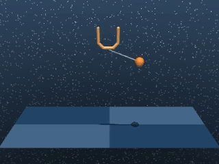

## Introduction
I simplified [martinseilair's](https://github.com/martinseilair/dm_control2gym) `dm_control2gym` as well as made it compatible with the latest `MuJoCo` library(e.g., 2.0.0). .... yeah,, I will upload the documents when I have time.


## Installation

```bash
$ pip install dm_control2gym
```


## Dependencies

- Please check the `requirements.txt` or just `pip install -r requirements.txt`


## Usage

- MDP tasks: `env` returns a state of a robot at each time-step

  `````python
  import itertools
  from dm_control2gym.util import make_dm2gym_env_state
  
  env = make_dm2gym_env_state(env_name="cheetah_run")
  
  state = env.reset()
  print("State shape: ", state.shape)
  
  total_reward = 0
  
  for t in itertools.count():
      action = env.action_space.sample()
      state, reward, done, _ = env.step(action)
      total_reward += reward
  
      if done: break
  
  env.close()
  print("Total Reward: {}".format(total_reward))
  `````

- POMDP tasks: `env` returns a raw image observation at each time-step

  `````python
  import itertools
  from dm_control2gym.util import make_dm2gym_env_obs
  from dm_control2gym.recorder import Monitor
  
  env = make_dm2gym_env_obs(env_name="cheetah_run", num_repeat_action=1)
  env = Monitor(env=env, directory="./log", force=True)
  
  obs = env.reset()
  print("Obs shape: ", obs.shape)
  
  total_reward = 0
  
  env.record_start()
  env.reset()
  for t in itertools.count():
      action = env.action_space.sample()
      obs, reward, done, _ = env.step(action)
      total_reward += reward
  
      if done: break

  env.record_end()
  env.close()
  print("Total Reward: {}".format(total_reward))
  `````
  


## Videos

  
  


## For more details
Please refer to [martinseilair's](https://github.com/martinseilair/dm_control2gym) `dm_control2gym`